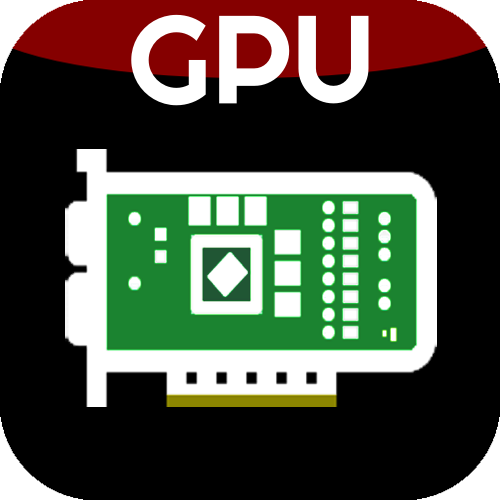

# Linux GPU Control Application



This application allows you to control your AMD, Nvidia or Intel GPU on a Linux system.

| GPU info                                     | Overclocking                                 | Fan control                                 |
|----------------------------------------------|----------------------------------------------|---------------------------------------------|
||||
| Historical data |
||

Current features:

- Viewing information about the GPU
- Power and thermals monitoring, power limit configuration
- Fan curve control (AMD and Nvidia)
- Overclocking (GPU/VRAM clockspeed and voltage)
- Power states configuration (AMD only)

All of the functionality works regardless of the desktop session (there is no dependency on X11 extensions).

# Installation

- Arch Linux: Install the package from official repositories: `pacman -S lact` (or `lact-git` from AUR for development builds).
- Debian/Ubuntu/Derivatives: Download a .deb from [releases](https://github.com/ilya-zlobintsev/LACT/releases/).

  It is only available on Debian 12+ and Ubuntu 22.04+ as older versions don't ship gtk4.
- Fedora: use the [Copr repository](https://copr.fedorainfracloud.org/coprs/ilyaz/LACT/), or download an RPM from [releases](https://github.com/ilya-zlobintsev/LACT/releases/).
- Gentoo: Available in [GURU](https://github.com/gentoo/guru/tree/master/sys-apps/lact).
- OpenSUSE: an RPM is available in [releases](https://github.com/ilya-zlobintsev/LACT/releases/).

  Only tumbleweed is supported as leap does not have the required dependencies in the repos.
- NixOS: There is a package available in [nixpkgs](https://search.nixos.org/packages?channel=24.05&from=0&size=50&sort=relevance&type=packages&query=lact)
- Otherwise, build from source.

**Why is there no AppImage/Flatpak/other universal format?**
See [here](./pkg/README.md).

Note: Nvidia support requires the Nvidia proprietary driver with CUDA libraries installed.

## Development builds

To get latest fixes or features that have not yet been released in a stable version, there are packages built from the latest commit that you can install from the [test release](https://github.com/ilya-zlobintsev/LACT/releases/tag/test-build) or using the `lact-git` AUR package on Arch-based distros.

Note: the date of the test release is not the date when the packages were built, the actual date is specified next to the attached package files.

# Usage

Enable and start the service (otherwise you won't be able to change any settings):
```
sudo systemctl enable --now lactd
```
You can now use the GUI to change settings and view information.

# Hardware support

## AMD

LACT for the most part does not implement features on a per-generation basis, rather it exposes the functionality that is available in the driver for the current system.
However the following table shows what functionality can be expected for a given generation.

- **Supported** - the functionality is known to work
- **Limited** - the functionality is known to work, but has certain limitations
- **Untested** - the functionality has not been confirmed to work, but it should
- **Unknown** - the functionality has not been confirmed to work, and it is unknown if it does
- **Unsupported** - the functionality is known to not work

| Generation                          | Clocks configuration | Power limit | Power states | Fan control | Notes                                             |
|-------------------------------------|----------------------|-------------|--------------|-------------|---------------------------------------------------|
| Southern Islands (HD 7000)          | Unsupported          | Unknown     | Unknown      | Untested    | Requires the `amdgpu.si_support=1` kernel option  |
| Sea Islands (R7/R9 200)             | Unsupported          | Unknown     | Untested     | Untested    | Requires the `amdgpu.cik_support=1` kernel option |
| Volcanic Islands (R7/R9 300)        | Unsupported          | Unknown     | Untested     | Untested    |                                                   |
| Arctic Islands/Polaris (RX 400-500) | Supported            | Supported   | Supported    | Supported   |                                                   |
| Vega                                | Supported            | Supported   | Supported    | Supported   |                                                   |
| RDNA1 (RX 5000)                     | Supported            | Supported   | Supported    | Supported   |                                                   |
| RDNA2 (RX 6000)                     | Supported            | Supported   | Supported    | Supported   |                                                   |
| RDNA3 (RX 7000)                     | Supported            | Supported   | Supported    | Supported   | Fan zero RPM mode is enabled by default even with a custom fan curve, and requires kernel 6.13 to be disabled. The power cap is sometimes reported lower than it should be. See [#255](https://github.com/ilya-zlobintsev/LACT/issues/255) for more info.   | 

GPUs not listed here will still work, but might not have full functionality available.
Monitoring/system info will be available everywhere. Integrated GPUs might also only have basic configuration available.

## Nvidia

Anything Maxwell or newer should work, but generation support has not yet been tested thoroughly.

## Intel

Functionality status on Intel GPUs:
- Clocks configuration - works on most devices, but there is no support for overclocking (clocks can only be adjusted within the default limits)
- Power limit - works on ARC dGPUs. The maximum power limit might not be reported by the GPU, so the UI will change depending on the current limit
- Monitoring - most values are shown on devices where they are applicable, dGPU temperature and fan speed reading might need a recent kernel version
- Fan control - not supported by the driver

# Configuration

There is a configuration file available in `/etc/lact/config.yaml`. Most of the settings are accessible through the GUI, but some of them may be useful to be edited manually (like `admin_groups` to specify who has access to the daemon)

See [CONFIG.md](./docs/CONFIG.md) for more information.

**Socket permissions setup:**

By default, LACT uses either ether the `wheel` or `sudo` group (whichever is available) for the ownership of the unix socket that the GUI needs to connect to.

On most configurations (such as the default setup on Arch-based, most Debian-based or Fedora systems) you do not need to do anything.

However, some systems may have different user configuration. In particular, this has been reported to be a problem on OpenSUSE.

To fix socket permissions in such configurations, edit `/etc/lact/config.yaml` and add your username or group as the first entry in `admin_groups` under `daemon`, and restart the service (`sudo systemctl restart lactd`).

# Overclocking (AMD)

The overclocking functionality is disabled by default in the driver. There are two ways to enable it:
- By using the "enable overclocking" option in the LACT GUI. This will create a file in `/etc/modprobe.d` that enables the required driver options. This is the easiest way and it should work for most people running standard distributions.

  **Note:** This will attempt to automatically regenerate the initramfs to include the new settings. It does not cover all possible distro combinations. If you've enabled overclocking in LACT but it still doesn't work after a reboot,
  you might need to check your distro's configuration to make sure the initramfs was updated. Updating the kernel version is a guaranteed way to trigger an initramfs update.
- Specifying a boot parameter. This might be needed if your distro is not supported by the auto-enable functionality. You can manually specify the `amdgpu.ppfeaturemask=0xffffffff` kernel parameter in your bootloader to enable overclocking. See the [ArchWiki](https://wiki.archlinux.org/title/AMDGPU#Boot_parameter) for more details.

## Power profiles daemon note!

If you are using `power-profiles-daemon` (which is installed by default on many distributions), by default it will override the amdgpu performance level setting according to its own profile.

To avoid this, create a file at `/etc/systemd/system/power-profiles-daemon.service.d/override.conf` with the following contents:
```
[Service]
ExecStart=
ExecStart=/usr/libexec/power-profiles-daemon --block-action=amdgpu_dpm
```
See https://github.com/ilya-zlobintsev/LACT/issues/370 for more information.

# Suspend/Resume

As some of the GPU settings may get reset when suspending the system, LACT will reload them on system resume. This may not work on distributions which don't use systemd, as it relies on the `org.freedesktop.login2` DBus interface.

# Building from source

Dependencies:
- rust 1.76+
- gtk 4.6+
- git
- pkg-config
- clang
- make
- hwdata
- libdrm
- blueprint-compiler 0.10.0+ (Ubuntu 22.04 in particular ships an older version in the repos, you can manually download a [deb file](http://de.archive.ubuntu.com/ubuntu/pool/universe/b/blueprint-compiler/blueprint-compiler_0.14.0-1_all.deb) of a new version)

Command to install all dependencies:
- Fedora: `sudo dnf install rust cargo make git clang gtk4-devel libdrm-devel blueprint-compiler`
- Arch: `sudo pacman -S --needed base-devel git clang make rust gtk4 hwdata blueprint-compiler`

Steps:
- `git clone https://github.com/ilya-zlobintsev/LACT && cd LACT`
- `make`
- `sudo make install`

It's possible to change which features LACT gets built with. 
To do so, replace the `make` command with the following variation:

Headless build with no GUI:
```
make build-release-headless
```

Build GUI with libadwaita support:
```
make build-release-libadwaita
```

# API

There is an API available over a unix or TCP socket. See [here](docs/API.md) for more information.

# Remote management

It's possible to have the LACT daemon running on one machine, and then manage it remotely from another.

This is disabled by default, as the TCP connection **does not have any authentication or encryption mechanism!**
Make sure to only use it in trusted networks and/or set up appropriate firewall rules.

To enable it, edit `/etc/lact/config.yaml` and add `tcp_listen_address` with your desired address and in the `daemon` section.

# Prometheus metrics exporter

LACT supports exposing a prometheus-compatible metrics endpoint for GPU monitoring.
See the `exporter_listen_address` option in [CONFIG.md](./docs/CONFIG.md).

List of supported metrics:
- `lact_gpu_info`
- `lact_gpu_usage`
- `lact_gpu_power_usage`
- `lact_gpu_cap`
- `lact_gpu_temperature`
- `lact_gpu_frequency`
- `lact_gpu_fan_pwm`
- `lact_gpu_fan_rpm`

Example:
```yaml
daemon:
  tcp_listen_address: 0.0.0.0:12853
  log_level: info
  admin_groups:
  - wheel
  - sudo
  disable_clocks_cleanup: false
```

After this restart the service (`sudo systemctl restart lactd`).

To connect to a remote instance with the GUI, run it with `lact gui --tcp-address 192.168.1.10:12853`.

# CLI

There is also a cli available.

- List system GPUs: 

    `lact cli list-gpus`

    Example output:

    ```
    1002:687F-1043:0555-0000:0b:00.0 (Vega 10 XL/XT [Radeon RX Vega 56/64])
    ```
- Getting GPU information:

    `lact cli info`

    Example output:

    ```
    lact cli info
    GPU Vendor: Advanced Micro Devices, Inc. [AMD/ATI]
    GPU Model: Vega 10 XL/XT [Radeon RX Vega 56/64]
    Driver in use: amdgpu
    VBIOS version: 115-D050PIL-100
    Link: LinkInfo { current_width: Some("16"), current_speed: Some("8.0 GT/s PCIe"), max_width: Some("16"), max_speed: Some("8.0 GT/s PCIe") }
    ```
    
The functionality of the CLI is quite limited. If you want to integrate LACT with some application/script, you should use the [API](API.md) instead.

# Reporting issues
 
When reporting issues, please include your system info and GPU model.

If you're having an issue with changing the GPU's configuration, it's highly recommended to include a debug snapshot in the bug report.
You can generate one using the option in the dropdown menu:


The snapshot is an archive which includes the SysFS that LACT uses to interact with the GPU.
 
If there's a crash, run `lact gui` from the command line to get GUI logs, check daemon logs in `journalctl -u lactd` for errors, 
and see `dmesg` for kernel logs that might include information about driver and system issues.

# Other tools

Here's a list of other useful tools for AMD GPUs on Linux:
- [CoreCtrl](https://gitlab.com/corectrl/corectrl) - direct alternative to LACT, provides similar functionality in addition to CPU configuration with a Qt UI
- [amdgpu_top](https://github.com/Umio-Yasuno/amdgpu_top) - tool for detailed real-time statistics on AMD GPUs
- [Tuxclocker](https://github.com/Lurkki14/tuxclocker) - Qt overclocking tool, has support for AMD GPUs
