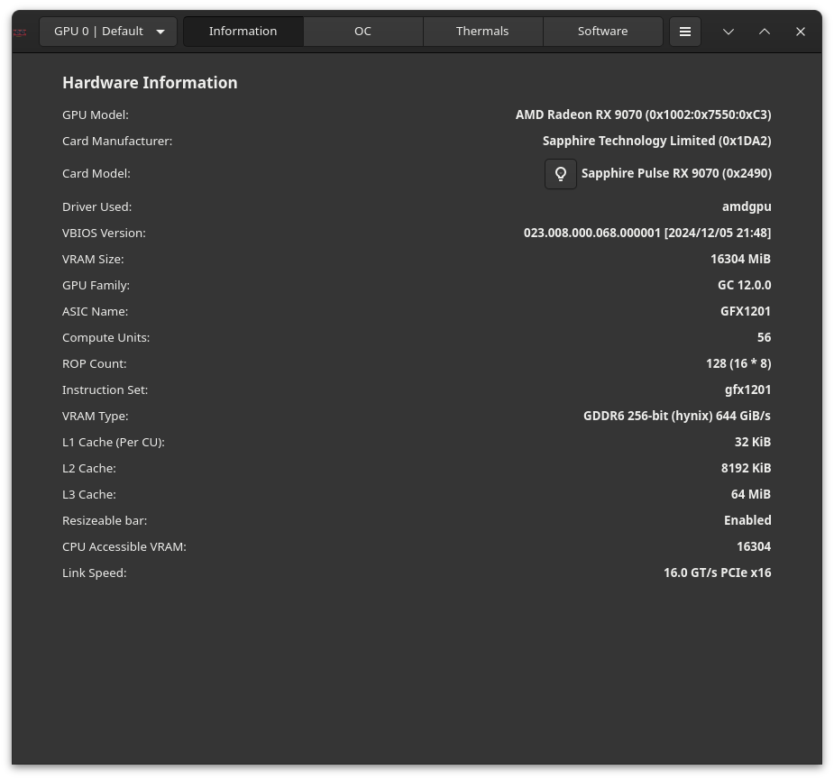
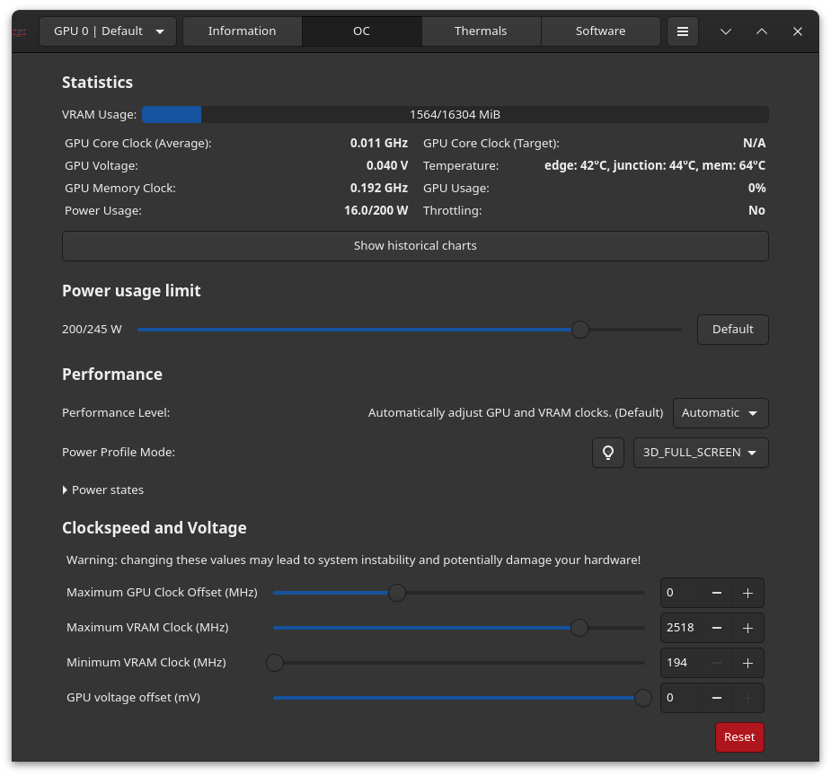
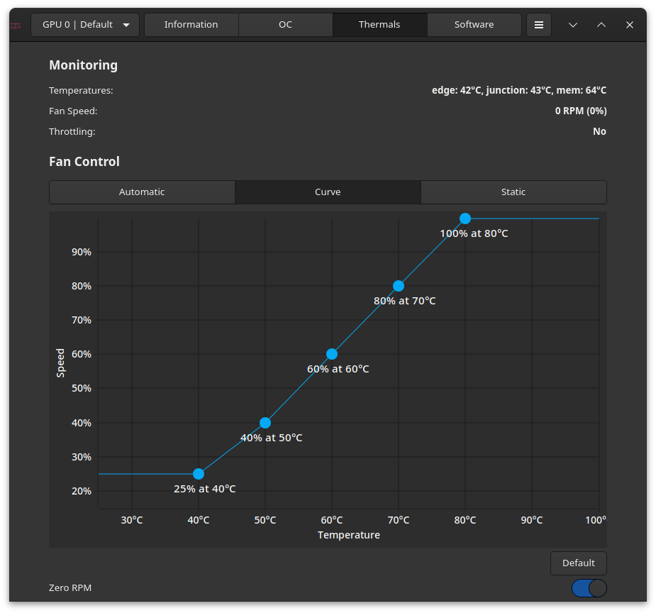
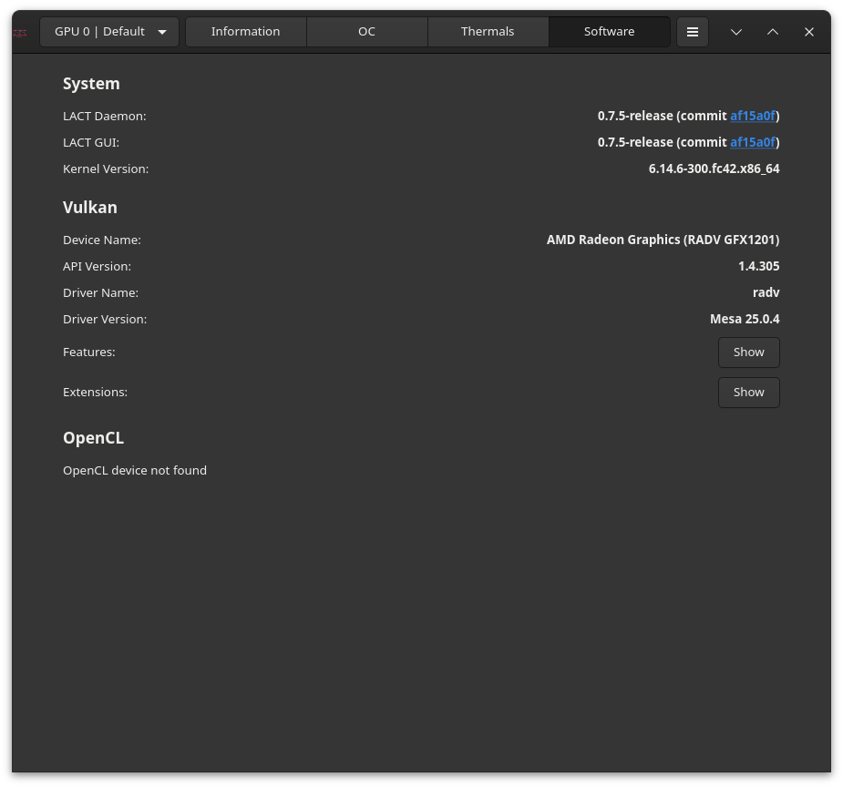
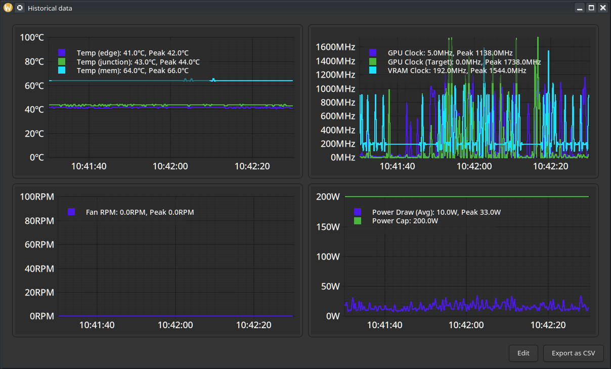

# Linux GPU Control Application


This application allows you to control your AMD, Nvidia or Intel GPU on a Linux
system.

| GPU info                          | Overclocking                      | Fan control                       |
| ----------------------------------| ----------------------------------| ----------------------------------|
|  |  |  |
| Software info                     | Historical data                   |                                   |
|  |  |                                   |

Current features:

- Viewing information about the GPU
- Power and thermals monitoring, power limit configuration
- Fan curve control (AMD and Nvidia)
- Overclocking (GPU/VRAM clockspeed and voltage)
- Power states configuration (AMD only)

All of the functionality works regardless of the desktop session (there is no
dependency on X11 extensions).

# Quick links

- [Installation](#installation)
- [Hardware support](https://github.com/ilya-zlobintsev/LACT/wiki/Hardware-Support)
- [Frequently asked questions](https://github.com/ilya-zlobintsev/LACT/wiki/Frequently-asked-questions)
- [Enable overclocking on AMD](https://github.com/ilya-zlobintsev/LACT/wiki/Overclocking-(AMD))
- [Config file reference](./docs/CONFIG.md)
- [API](./docs/API.md)
- [Power profiles daemon note](#power-profiles-daemon-note)
- [Recovery from a bad overclock](https://github.com/ilya-zlobintsev/LACT/wiki/Recovering-from-a-bad-overclock)

# Installation

- Arch Linux: Install the package from official repositories: `pacman -S lact`
  (or `lact-git` from AUR for development builds).
- Debian/Ubuntu/Derivatives: Download a .deb from
  [releases](https://github.com/ilya-zlobintsev/LACT/releases/).

  It is only available on Debian 12+ and Ubuntu 22.04+ as older versions don't
  ship gtk4.
- Fedora: use the
  [Copr repository](https://copr.fedorainfracloud.org/coprs/ilyaz/LACT/), or
  download an RPM from
  [releases](https://github.com/ilya-zlobintsev/LACT/releases/).
- Bazzite: Install with `ujust install-lact`.

  This helper installs the Flatpak version and automatically adds the AMD
  overclocking boot option.
- Gentoo: Available in
  [GURU](https://github.com/gentoo/guru/tree/master/sys-apps/lact).
- OpenSUSE: an RPM is available in
  [releases](https://github.com/ilya-zlobintsev/LACT/releases/).

  Only tumbleweed is supported as leap does not have the required dependencies
  in the repos.
- NixOS: There is a package available in
  [nixpkgs](https://search.nixos.org/packages?channel=24.05&from=0&size=50&sort=relevance&type=packages&query=lact)
- Flatpak (universal): Available on [Flathub](https://flathub.org/apps/io.github.ilya_zlobintsev.LACT) and in [releases](https://github.com/ilya-zlobintsev/LACT/releases/).

  See the [Flatpak documentation](./flatpak/README.md) for setup notes.
- Build from source.

Note: Nvidia support requires the Nvidia proprietary driver with CUDA libraries
installed.

## Development builds

To get latest fixes or features that have not yet been released in a stable
version, there are packages built from the latest commit that you can install
from the
[test release](https://github.com/ilya-zlobintsev/LACT/releases/tag/test-build)
or using the `lact-git` AUR package on Arch-based distros.

Note: the date that GitHub shows next to the test release is not when the packages were built,
the actual date is specified next to the attached package files.

# Usage

Enable and start the service (otherwise you won't be able to change any
settings):

```
sudo systemctl enable --now lactd
```

You can now use the GUI to change settings and view information.

# Hardware support

See the
[Wiki page](https://github.com/ilya-zlobintsev/LACT/wiki/Hardware-Support)

# Configuration

There is a configuration file available in `/etc/lact/config.yaml`. Most of the
settings are accessible through the GUI, but some of them may be useful to be
edited manually (like `admin_group` and `admin_user` to specify who has access
to the daemon)

See [CONFIG.md](./docs/CONFIG.md) for more information.

**Socket permissions setup:**

By default, LACT uses either ether the `wheel` or `sudo` group (whichever is
available) for the ownership of the unix socket that the GUI needs to connect
to.

On most desktop configurations (such as the default setup on Arch-based, most
Debian-based or Fedora systems) this includes the default user, so you do not
need to configure this.

However, some systems may have different user configuration. In particular, this
has been reported to be a problem on OpenSUSE.

To fix socket permissions in such configurations, edit `/etc/lact/config.yaml`
and under the `daemon` section either:

- Set `admin_user` to your username
- Set `admin_group` to a group that your user is a part of Then restart the
  service (`sudo systemctl restart lactd`).

# Overclocking (AMD)

Some functionality requires enabling an option in the amdgpu driver, see the
[wiki page](https://github.com/ilya-zlobintsev/LACT/wiki/Overclocking-(AMD)) for
more information.

## Power profiles daemon note!

If you are using `power-profiles-daemon` (which is installed by default on many
distributions), by default it may override the amdgpu performance level setting
according to its own profile.

When using LACT 0.7.5+ and power-profiles-daemon 0.30+, LACT will try to connect to power-profiles-daemon 
and automatically disable the conflicting amdgpu action in ppd to avoid this conflict.

If running older versions, you can resolve this manually by creating a file at
`/etc/systemd/system/power-profiles-daemon.service.d/override.conf` with the
following contents:

```
[Service]
ExecStart=
ExecStart=/usr/libexec/power-profiles-daemon --block-action=amdgpu_dpm
```

Note: the `/usr/libexec` path might be different on your system, check it in
`systemctl status power-profiles-daemon`

See https://github.com/ilya-zlobintsev/LACT/issues/370 for more information.

# Suspend/Resume

As some of the GPU settings may get reset when suspending the system, LACT will
reload them on system resume. This may not work on distributions which don't use
systemd, as it relies on the `org.freedesktop.login2` DBus interface.

# Building from source

Dependencies:

- rust 1.76+
- gtk 4.6+
- git
- pkg-config
- clang
- make
- hwdata
- libdrm
- vulkan-tools
- ocl-icd

Command to install all dependencies:

- Fedora:
  `sudo dnf install rust cargo make git clang gtk4-devel libdrm-devel vulkan-tools OpenCL-ICD-Loader-devel`
- Arch:
  `sudo pacman -S --needed base-devel git clang make rust gtk4 hwdata vulkan-tools ocl-icd`

Steps:

- `git clone https://github.com/ilya-zlobintsev/LACT && cd LACT`
- `make`
- `sudo make install`

It's possible to change which features LACT gets built with. To do so, replace
the `make` command with the following variation:

Headless build with no GUI:

```
make build-release-headless
```

Build GUI with libadwaita support:

```
make build-release-libadwaita
```

# Remote management

It's possible to have the LACT daemon running on one machine, and then manage it
remotely from another.

This is disabled by default, as the TCP connection **does not have any
authentication or encryption mechanism!** Make sure to only use it in trusted
networks and/or set up appropriate firewall rules.

To enable it, edit `/etc/lact/config.yaml` and add `tcp_listen_address` with
your desired address and in the `daemon` section.

Example:

```yaml
daemon:
  tcp_listen_address: 0.0.0.0:12853
  log_level: info
  admin_group: wheel
  disable_clocks_cleanup: false
```

After this restart the service (`sudo systemctl restart lactd`).

To connect to a remote instance with the GUI, run it with
`lact gui --tcp-address 192.168.1.10:12853`.

# CLI

There is also a cli available.

- List system GPUs:

  `lact cli list-gpus`

  Example output:

  ```
  10DE:2704-1462:5110-0000:09:00.0 (AD103 [GeForce RTX 4080])
  ```
- Getting GPU information:

  `lact cli info`

  Example output:

  ```
  $ lact cli info
  GPU 10DE:2704-1462:5110-0000:09:00.0:
  =====================================
  GPU Model: NVIDIA GeForce RTX 4080 (0x10DE:0x2704)
  Card Manufacturer: Micro-Star International Co., Ltd. [MSI] (0x1462)
  Card Model: Unknown (0x5110)
  Driver Used: nvidia 570.124.04
  VBIOS Version: 95.03.1E.00.60
  VRAM Size: 16376 MiB
  GPU Family: Ada
  Cuda Cores: 9728
  SM Count: 76
  ROP Count: 112 (14 * 8)
  VRAM Type: GDDR6x
  VRAM Manufacturer: Micron
  L2 Cache: 65536 KiB
  Resizeable bar: Enabled
  CPU Accessible VRAM: 16384
  Link Speed: 8 GT/s PCIe gen 3 x8
  ```

The functionality of the CLI is quite limited. If you want to integrate LACT
with some application/script, you should use the [API](API.md) instead.

# Reporting issues

When reporting issues, please include your system info and GPU model.

If you're having an issue with changing the GPU's configuration, it's highly
recommended to include a debug snapshot in the bug report. You can generate one
using the option in the dropdown menu:


The snapshot is an archive which includes the SysFS that LACT uses to interact
with the GPU.

If there's a crash, run `lact gui` from the command line to get GUI logs, check
daemon logs in `journalctl -u lactd` for errors, and see `dmesg` for kernel logs
that might include information about driver and system issues.

# Support the project

If you wish to support the project, you can do so via Patreon:
https://www.patreon.com/IlyaZlobintsev

Or using cryptocurrency:
- BTC: `12FuTXZzd5peGb7QfoRkXaLnbJ1DNVW4pP`
- ETH: `0x80875173316aa6317641bfbc50644e7ca74d6b6d`
- XMR: `42E93NZXM7STBUsnMRGNyxKryFVgpHKNP6aza94C5hn17j2W7zUnFHe7ASQzB3KorYYnsaVzWUyHHVYfcTLQRtB63qkv5jE`

# Other tools

Here's a list of other useful tools for AMD GPUs on Linux:

- [CoreCtrl](https://gitlab.com/corectrl/corectrl) - direct alternative to LACT,
  provides similar functionality in addition to CPU configuration with a Qt UI
- [amdgpu_top](https://github.com/Umio-Yasuno/amdgpu_top) - tool for detailed
  real-time statistics on AMD GPUs
- [Tuxclocker](https://github.com/Lurkki14/tuxclocker) - Qt overclocking tool,
  has support for AMD GPUs
