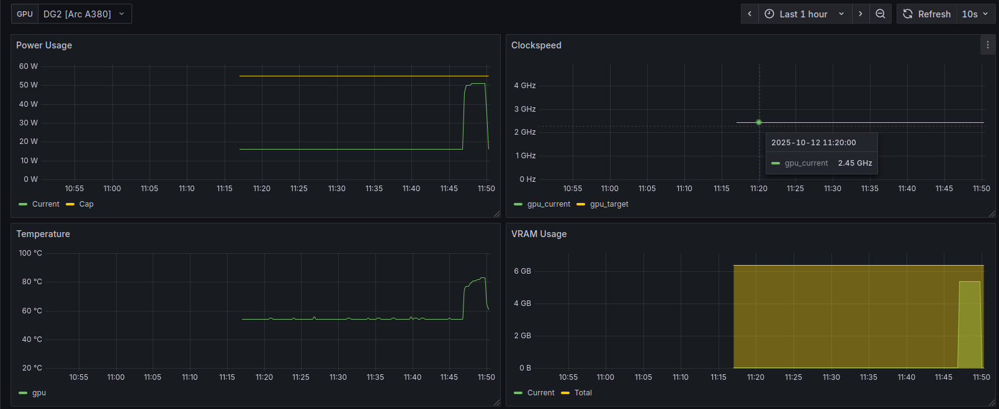

# OpenTelemetry exporter

The LACT daemon supports exporting GPU metrics using the standard [OpenTelemetry metrics API](https://opentelemetry.io/docs/specs/otel/metrics/).
In particular, it uses the [OTLP/HTTP](https://opentelemetry.io/docs/specs/otlp/#otlphttp) protocol with a JSON payload.

To use this functionality, you need an OpenTelemetry-compatible metrics collector such as Prometheus [with OTLP support enabled](https://prometheus.io/docs/guides/opentelemetry/).

After this, you need to set the collector URL in `/etc/lact/config.yaml`. For example:
```yaml
daemon:
  metrics:
    # This example is a local Prometheus URL. Other collectors might simply use `/v1/metrics` as the path.
    collector_address: 'http://localhost:9090/api/v1/otlp/v1/metrics' 
    # Metrics collection interval in seconds. Not necessary to set, defaults to 30 seconds.
    interval: 30 
```

Restart the daemon after changing the config.

The following metrics are currently supported :
- lact_gpu_usage
- lact_gpu_power_usage
- lact_gpu_power_usage_cap
- lact_gpu_temperature
- lact_gpu_clockspeed
- lact_gpu_voltage
- lact_gpu_fan_speed
- lact_gpu_fan_speed_max
- lact_gpu_fan_percent
- lact_gpu_vram_used
- lact_gpu_vram_total


Note: this is the source metric name, collectors might alter it for queries. For example, Prometheus adds a unit suffix, e.g. `lact_gpu_power_usage` -> `lact_gpu_power_usage_watts`

